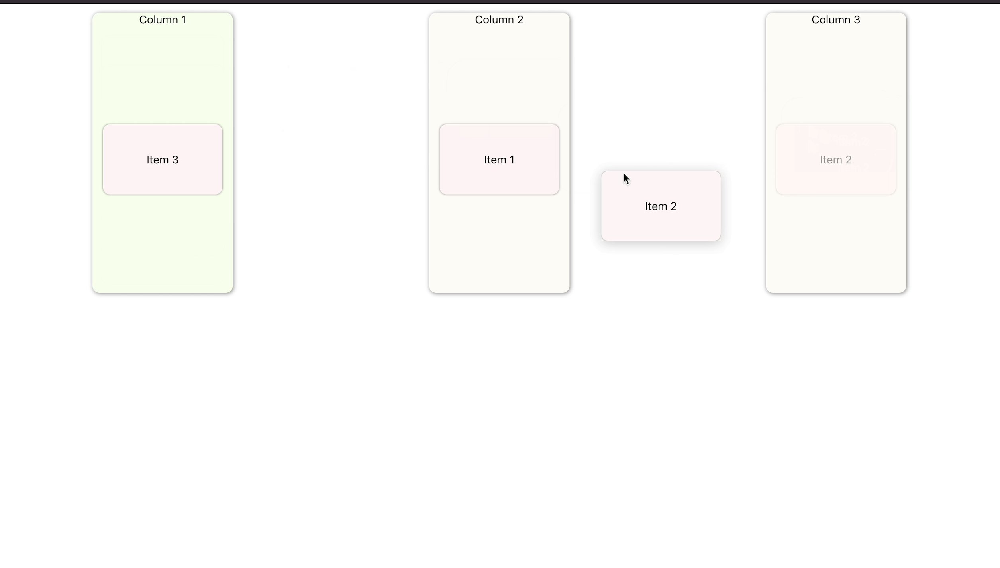
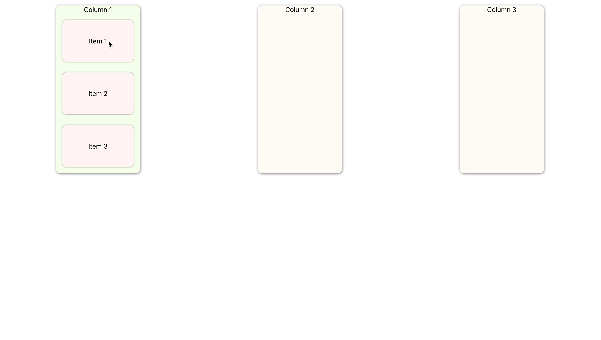

<h1 align="center"> DRAG AND DROP (REACT)</h1>

<p align="center">
  
  
  
  
</p>



<h2 align="center"><a  href="https://r2alpha.github.io/react-dnd/">Live Demo</a></h2>

## Description

**Drag and drop column**

<p>
  
</p>

### About 

React Drag and Drop (React DND) is a demo app to illustrate drag and drop between different container in react. 
This can be referred while implementing feature such as draggable list. As of now we are not supporting drag and drop for touch screen or other pointer devices. Though this is in pipeline but we can't commit for the exact date. 

DND (Drag and Drop) was created with React.

### Future Scope 

- Provide support for touch screen 

### Development

## Clone and install

```
git clone git@github.com:R2ALPHA/react-dnd.git
cd react-dnd
npm i
```

<p> Run a development server </p>

```
npm run start 
```

## Author 

- [Gourav Anand](https://github.com/R2ALPHA)

## License

This project is open source and available under the [MIT LICENSE](./LICENSE.md). 


